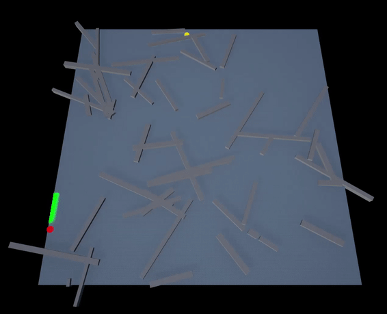

# PathfindingAStar_UE5
 
A simple implementation of A* pathfinding algorithm in UE5 C++. Finds the best path from Point A to Point B on a fixed field. Randomly generated obstacles and random start/finish locations can be chosen with simple UI for testing. 

TODO
[x] Port to UE5.1
[ ] Refactor using heaps
[ ] Parallelize
[ ] Rewrite in 3 dimenstions, for spaceships?

### UI
.png)
